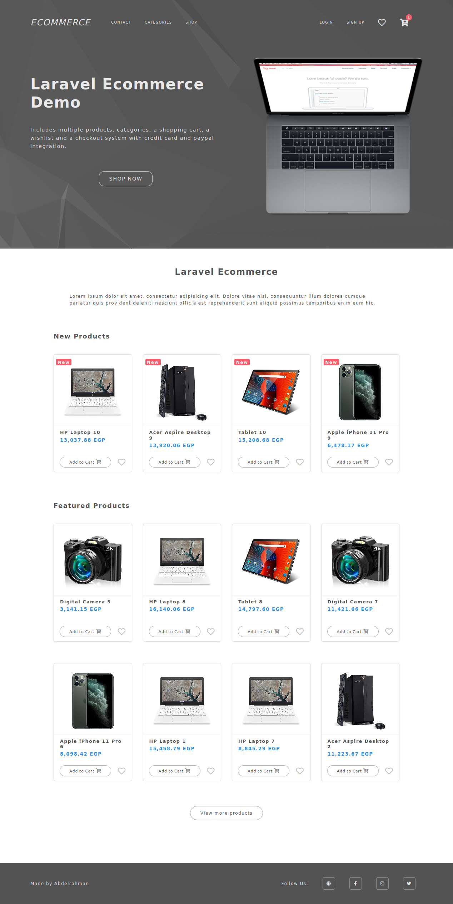
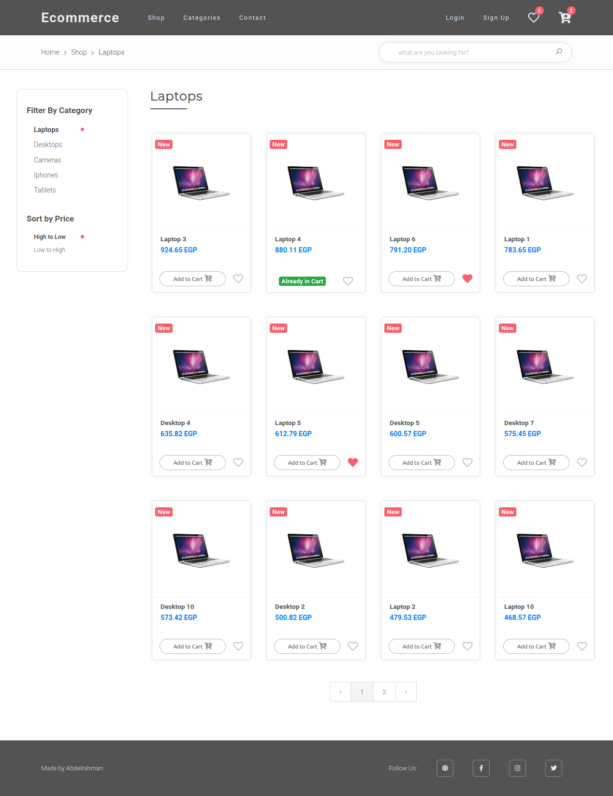
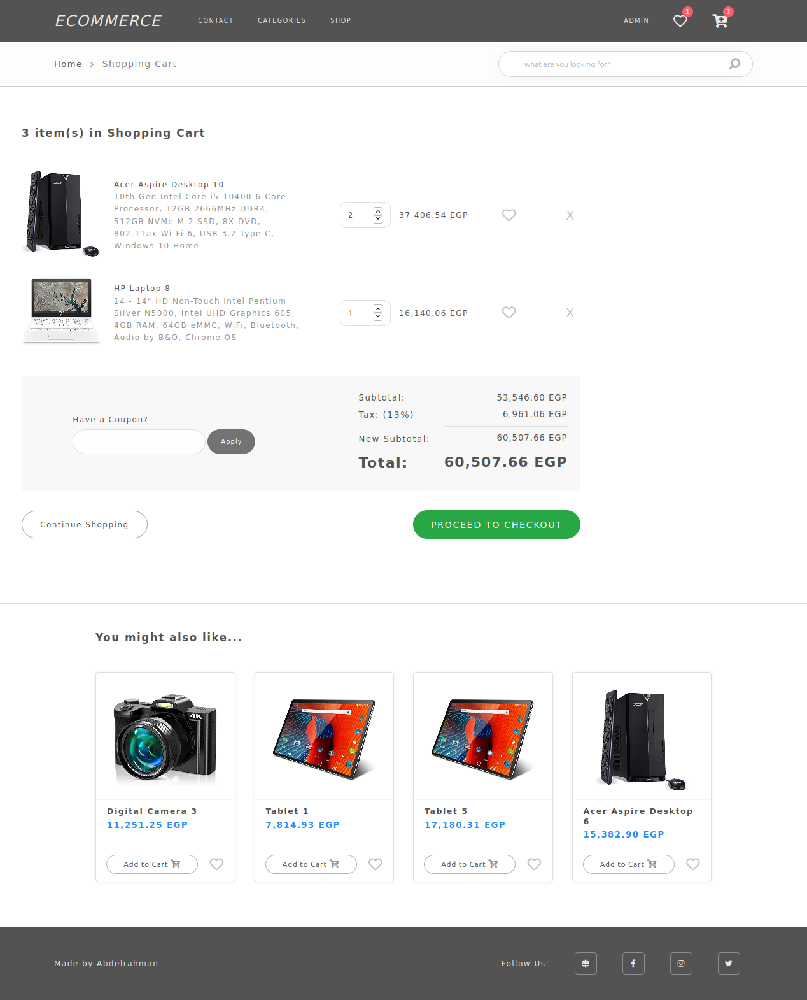

## About the Project

An E-Commerce website built with Laravel Framework, Vuejs, and Javascript.

### Some Features:

- A user or a guest can add products to their cart and wishlist.
- They can make use of coupons and checkout for products.
- Autocomplete search is applied

The website is deployed on Amazon Cloud (AWS EC2). Check [Website](http://ec2-15-237-94-238.eu-west-3.compute.amazonaws.com)

### Tools & Packages:

- [hardevine/LaravelShoppingcart](https://github.com/hardevine/LaravelShoppingcart) package is utilized to manage the cart.
- [MeiliSearch](https://www.meilisearch.com) search engine is integrated through [docs-searchbar.js](https://github.com/meilisearch/docs-searchbar.js) SDK and [MeiliSearch Laravel Scout](https://github.com/meilisearch/meilisearch-laravel-scout) driver for autocomplete search.
- [Voyager](https://voyager.devdojo.com/) admin package is utilized for the admin panel.
- Available payment methods: [Paypal](https://www.paypal.com/), Visa, and Mastercard (through [PayTabs](https://site.paytabs.com) gateway).

	
<a href="http://ec2-15-237-94-238.eu-west-3.compute.amazonaws.com">Project Demo</a>

	
<a href="http://ec2-15-237-94-238.eu-west-3.compute.amazonaws.com/admin/login">Admin Panel</a>

### Test Information:

- Admin Account:
	- email: admin@admin.com 	pass: password
- Coupons: ABC123 , DEF456
- Visa Test Card Number: 4111111111111111
- PayPal Sandbox Personal Account:
	- email: sb-q0ii34134985@personal.example.com   pass: Ci@9p+MS

